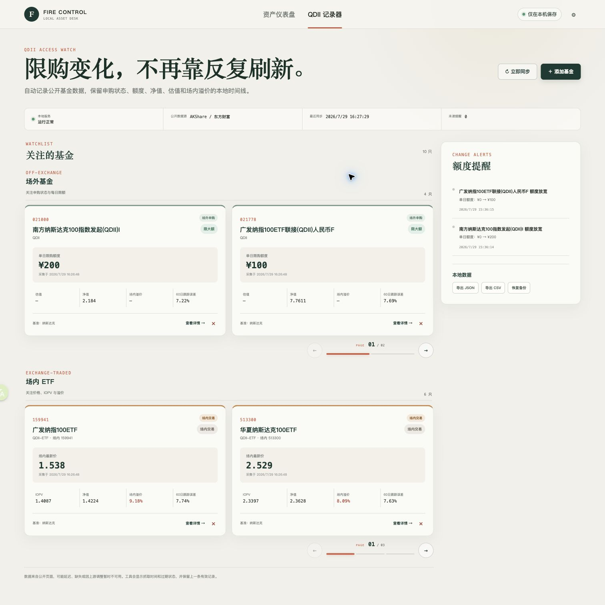

# FIRE 资产配置与 QDII 记录器

一个只在本机运行的资产配置与基金观察工具。它把 FIRE 资产规划、压力测试和 QDII
限购跟踪放在同一个网页中，所有个人资产数据保存在本地 SQLite 数据库。

项目不连接券商、不读取证券账户、不自动下单，也不会把个人资产数据上传到远程服务器。

## 效果展示



QDII 记录器将场外基金与场内 ETF 分组展示，每页 2 只基金，并集中呈现额度、净值、
溢价、数据新鲜度和额度放宽提醒。

## 项目特点

### FIRE 资产仪表盘

- 记录货币、短债、中长债、纳指 100、黄金和数字资产六类人民币市值
- 自动计算纳指 100 权益比例，以及距离 50% ± 10% 再平衡区间的距离
- 模拟市场下跌 10%、30%、50% 后的资产损失和仓位变化
- 按年度支出与预期实际收益率估算资产可持续时间
- 保留每日资产快照，支持 JSON 备份恢复和 CSV 导出

### QDII 记录器

- 分组展示场外基金和场内 ETF
- 记录申购状态、单日限额、估值、净值、场内价格、IOPV 与溢价
- 使用至少 30 个重合交易日的数据计算 60 日滚动跟踪误差
- 日限额提高、恢复申购或额度由零变为正数时生成提醒
- 工作日自动同步，也支持手动刷新和历史记录查看
- 公开行情缺失时保留上一条有效值并标记数据过期

## 技术架构

- React + TypeScript + Vite
- FastAPI + APScheduler
- SQLite 本地持久化
- AKShare / 东方财富公开行情适配器
- FastAPI 同源提供前端页面和本地 REST API

生产运行只需一个本机进程，服务固定绑定 `127.0.0.1`。

## Clone 后使用

### 环境要求

- macOS
- Python 3.11+
- Node.js 20.19+
- Git

### 安装与启动

```bash
git clone https://github.com/boyl/fire-qdii-dashboard.git
cd fire-qdii-dashboard
./scripts/install_local.sh
./scripts/start_local.sh
```

安装脚本会创建 Python 虚拟环境、安装前后端依赖并构建前端。启动后浏览器会自动打开：

```text
http://127.0.0.1:4310
```

### 登录后自动运行

安装 macOS LaunchAgent：

```bash
./scripts/install_launch_agent.sh
```

移除后台服务但保留本地数据库：

```bash
./scripts/uninstall_launch_agent.sh
```

## 数据与隐私

- 数据库默认位置：`data/fire_qdii.sqlite3`
- 数据库、日志、虚拟环境和构建产物均被 Git 忽略
- 所有页面和 API 仅绑定 `127.0.0.1`，局域网中的其他设备也无法直接访问
- 除获取公开基金与指数行情外，应用不会向外发送数据
- 不保存券商账号、交易凭证或自动交易配置

## 开发与验证

完成安装后，分别启动本地 API 和 Vite 开发服务器：

```bash
.venv/bin/uvicorn server.main:app --host 127.0.0.1 --port 4310
npm run dev
```

运行全部本地测试：

```bash
.venv/bin/python -m unittest discover -s tests -p 'test_*.py'
npm run lint
npm test
```

自动测试使用固定模拟行情，不依赖实时网络。

## 数据源与免责声明

QDII 数据来自 AKShare 所适配的东方财富等公开行情页面。公开接口可能延迟、缺失或变更，
采集结果仅作为尽力服务；应用会显示来源时间和数据新鲜度，但不能保证数据完整或实时。

FIRE 估算不包含税费、交易成本、养老金、未来收入和随机收益波动。项目仅用于个人记录与
情景分析，不构成投资建议。

## License

[MIT](LICENSE)
